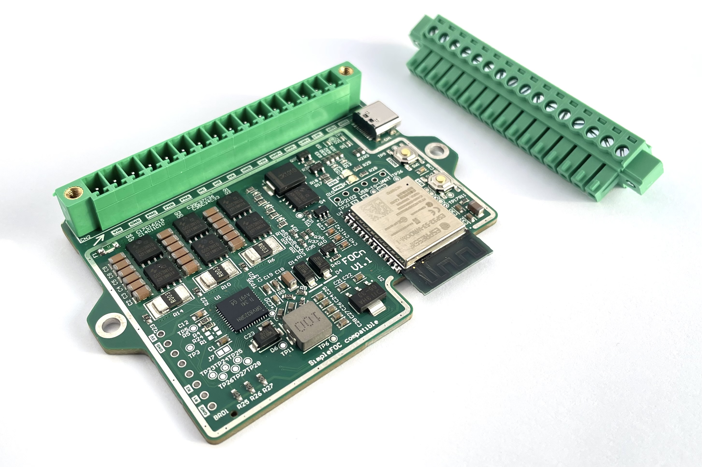

# *FOCn*

A SimpleFOC compatible medium-power BLDC driver module with Wi-Fi and BT connectivity

# Features

- Fully compatible with SimpleFOC field-oriented control library for easy programing
- High input voltage, up to 45V (up to 10s lithium battery)
- Up to 10A motor current without extra cooling
- Robust low-side current sensing for torque-control applications
- Supports hall sensors and encoders
- Based on ESP32-S3 dual core MCU
- built-in USB-C and Wi-Fi/BLE connectivity
- High power PWM output for solenoids, latches, magnetic brakes
- Power saving features for battery operation
- Pluggable terminal block for easy and robust connections

# Specs

- Input voltage: 9V-45V (3s - 10s lithium)
- Input current: 10A const., fuse protected
- Phase current: 10A const., 25A peak (more possible with enhanced cooling)
- Phase current measurement range: +-38A
- HVP PWM output current: 5A average
- HVP PWM load type: Supports inductive loads (flyback diode protection)
- Hall/encoder supply voltage: 5V
- Allowable external load on 5V supply: 300mA“
- Idle current consumption (motor driver disabled, MCU seep sleep): <200uA

# Where to get
*FOCn* is available on Tindie store.

# Getting started

### Connector pinout

Pin 1 is marked with an arrow near the connector. Compatible wire thickness is AWG18 to AWG16 (0.5 to 1.5 mm2).

| Pin | Marking | Description |
| --- | --- | --- |
| 1 | VIN | Supply voltage positive |
| 2 | GND | Supply voltage negative |
| 3 | PHC | Motor phase C |
| 4 | PHB | Motor phase B |
| 5 | PHA | Motor phase A |
| 6 | HC | Hall C / Encoder A/B |
| 7 | HB | Hall B / Encoder A/B |
| 8 | HA | Hall A / Encoder A/B |
| 9 | GND | Hall / Encoder supply voltage negative |
| 10 | +5V | Hall / Encoder supply voltage positive |
| 11 | HVP+ | High voltage PWM output positive (low side switched! HVP+ is connected to VIN) |
| 12 | HVP- | High voltage PWM output negative (low side switched!) |
| 13 | LVP+ | Low voltage PWM positive (high side switched) |
| 14 | LVP- | Low voltage PWM negative (high side switched) |
| 15 | AIO1 | Auxilary digital input 1 |
| 16 | AIO2 | Auxilary digital input 2 |

Pluggable screw terminal block part number: MAX MX15EDGKM-3.81-16P-GN01-Cu-Y-A

## Powering *FOCn*

Allowable input voltage is from 9V to 45V. Recomended cell count for lithium batteries is 3s to 10s, depending on your application. If using a power supply that is not a battery, carefully consider the effects of regenerative breaking. 

If your application requires high motor currents, consider adding an extra capacitor to the supply input, especially if other devices are powered by the same supply rail. 470uF 50V low ESR capacitor as close as possible to the input voltage terminals is recomended.

### Programming

*FOCn* can be programmed and debugged via the onboard USB-C which is connected to the ESP32’s native USB port. Programing should start automatically. If not, BOOT and RESET pushbuttons are available to control boot and programming. UART0 port is exposed on an unpopulated header.

### Motor connection

Motor phases should be connected at the screw terminal. Wiring should be as short as possible.

### Position sensors

Hall sensors or encoders with AB output can be connected to HA, HB, HC inputs. Inputs are filtered to avoid glitches caused by switching noise coupling to singal lines and strongly pulled up to 3.3V (MCU IO voltage). Pull-up voltage can be disabled from software for power saving during deep sleep.

HA, HB, HC inputs can also be used as general purpose IO by jumping jumpers J1, J2, J3 on the back of the PCB. Do this only if you know exactly what you are doing! **Warning: maximum allowable voltage input if jumpers are jumped is 3.3V!**

I2C encoders are also supported. Connect the data lines to AUX inputs.

### HVP output

High-voltage PWM is a low-side switched output designed for auxilary loads such as solenoids, magnetic brakes, indicator lights and other auxilary loads at up to 5A average current. Voltage is unregulated (same as input voltage to FOCn). Output can be used safely with inductive loads.

### LPV output

Low-voltage PWM is a high-side switched output designed for small auxilary loads such as sensors, indicator lights and communication modules. Up to 300mA is allocated for external loads. LVP can also be used to disable hall / encoder power for lower sleep current consumption.

### AUX inputs

Two auxilary inputs are available to be used with various sensors, safety switches, etc. Inputs are pulled up to 3.3V to support switches and open-drain outputs commonly used in industrial sensors. Maximum allowable voltage on auxilary inputs is 24V. To use auxilary inputs as outputs or data lines for I2C encoders, jump J4 and J5 on the back side of the PCB. This jumps the series protection resistor and provides a direct connection to MCU (3.3V signal level). **Warning: maximum allowable voltage input if jumpers are jumped is 3.3V!**

### RF keyfob receiver module

Keyfob remote module can be added to *FOCn*. The unpopulated header (bottom left) is designed to accept a HCS-300 rolling code receiver module. Two digital signals are connected to the MCU (D1 and D2). (module available here: https://www.parallax.com/product/key-fob-remote-and-receiver-pcb/)

### Wireless communication (Wi-Fi / BT)

The ESP32-S3 module has a built-in Wi-Fi and BLE modem which can be used to communicate with and control *FOCn*. ESP32-S3 also supports Espressif’s ESP-NOW protocol which is very suitable for BLDC control due to low latency and processing overhead. If possible, run communication and BLDC driver code on sepparate CPU cores.

### Adding extra cooling

If prolonged high motor currents (>10A) and/or high ambient temperatures (>35degC) are expected, aditional cooling should be added. This can be done by attaching a heat-dissipating body to the back of *FOCn* with a thermal pad (most heat is produced below the MOSFETs) or forced air cooling (fan)

### MCU pin mapping

| Name | GPIO | Description |
| --- | --- | --- |
| USR-LED | IO46 | User LED (yellow) |
| GDRV-INHA | IO12 | Phase A PWM |
| GDRV-INHB | IO13 | Phase B PWM |
| GDRV-INHC | IO14 | Phase C PWM |
| SHUNT-AMP-OUT-A | IO4 | Phase A current analog signal |
| SHUNT-AMP-OUT-B | IO6 | Phase B current analog signal |
| SHUNT-AMP-OUT-C | IO5 | Phase C current analog signal |
| HVPWM-CTRL | IO35 | HVPWM PWM control signal |
| LVPWM-CTRL | IO47 | LVPWM PWM control signal |
| N-HALL-PU-EN | IO48 | Hall pullup voltage enaple (active low) |
| GDRV-ENABLE | IO41 | Gate driver enable (enables BLDC driver) |
| GDRV-nFAULT | IO42 | Gate driver fault flag (active low) |
| GDRV-AMP-CAL | IO40 | Shunt amplifier offset calibration trigger |
| HALL-A | IO38 | Hall A signal |
| HALL-B | IO37 | Hall B signal |
| HALL-C | IO36 | Hall C signal |
| AUX-1 | IO10 | AUX-1 signal |
| AUX-2 | IO9 | AUX-2 signal |
| VIN-MEAS | IO8 | Suply voltage measurement analog input |
| RF-REMOTE-D1 | IO1 | RF remote module D1 signal |
| RF-REMOTE-D1 | IO2 | RF remote module D2 signal |
| TP-IO3 | IO3 | TP36 test point |
| TP-IO7 | IO7 | TP31 test point |
| TP-IO11 | IO11 | TP32 test point |
| TP-IO15 | IO15 | TP33 test point |
| TP-IO16 | IO16 | TP34 test point |
| TP-IO17 | IO17 | TP29 test point |
| TP-IO18 | IO18 | TP30 test point |

### Example project
Example *PlatformIO* project is available in the *Examples* folder. It implements basic control of a hoverboard hub motor (with phase current control) and demonstrates basic usage of *FOCn*. As the motor control input, a standard RC PWM signal is used. When developing your own projects, it is recomended to use the *PlatformIO* board file used in the example project (*/boards/FOCn_board.json*).

